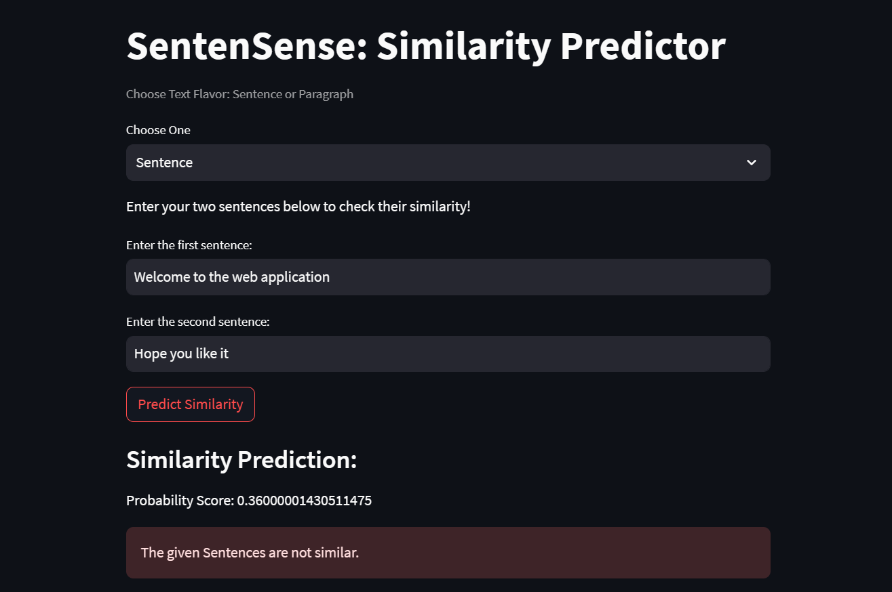

# SentenSense: Semantic Similarity between Sentences or Paragraphs

## Project Introduction
SentenSense is a Streamlit web application that enables users to explore the semantic similarity between sentences or paragraphs. The app uses Sentence Transformers, a powerful natural language processing model, to encode text into dense vector representations and calculate cosine similarity scores between two input texts.



# Fine-Tuned Sentence Transformers Model

The Sentence Transformers model used in SentenSense is fine-tuned on the [SICK dataset](https://marcobaroni.org/composes/sick.html) to improve semantic similarity performance. The base model, `nli-distilroberta-base-v2`, achieved a similarity performance of 0.787. After fine-tuning on the SICK dataset, SentenSense's customized model achieved an impressive similarity performance of `0.852`, `enhancing the accuracy of similarity predictions by 8.25%`.


## Hugging Face Model Hub

The fine-tuned model used in SentenSense is available on the Hugging Face Model Hub under the name "Ketan3101/sentensense." You can easily download and use the model in your own projects using the following code:

```bash
from sentence_transformers import SentenceTransformer
model = SentenceTransformer("Ketan3101/sentensense")
```

## How to Use

1. Install the required dependencies by running
    ```bash
    pip install -r requirements.txt
2. Run SentenSense.py:
    ```bash
    streamlit run SentenSense.py

3. When the app starts, you will be presented with the option to choose between `Sentence` or `Paragraph`.

4. If you select `Sentence`, you can enter two sentences in the input fields provided. The app will calculate the semantic similarity between the two sentences and display the result.

5. If you choose `Paragraph`, you can enter two paragraphs in the text areas provided. The app will then determine the semantic similarity between the two paragraphs and display the result.

6. Press the `Predict Similarity` button to trigger the similarity calculation and see the results.

7. The app will also provide an overall analysis, indicating whether the given sentences or paragraphs are considered similar or dissimilar based on a predefined threshold.

## Technologies Used
* Python
* Numpy
* Streamlit
* Fined-tuned Sentence Transformer
## Acknowledgements
I would extend my sincere appreciation to the developers and maintainers of the Sentence Transformers library, SentenceTransformers. Their outstanding contributions to the field of natural language processing have played a pivotal role in the success of project. The original `nli-distilroberta-base-v2` model, developed by them, forms the core foundation upon which our fine-tuned model is built.

Additionally, I would like to acknowledge the creators of the SICK dataset for making it available to the public. Their efforts in curating this valuable dataset have been instrumental in enhancing the performance of our model through fine-tuning.

## License

This project is licensed under the `Creative Commons Attribution-NonCommercial-ShareAlike` - see the [LICENSE](https://creativecommons.org/licenses/by-nc-sa/3.0/) file for details.

Feel free to explore semantic similarity with SentenSense and enjoy the experience of analyzing the relationships between sentences or paragraphs!
